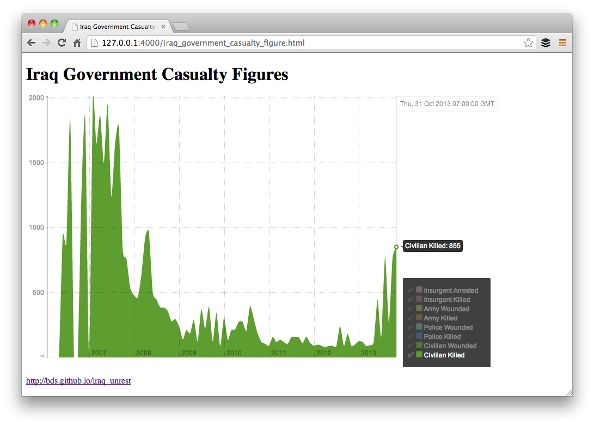
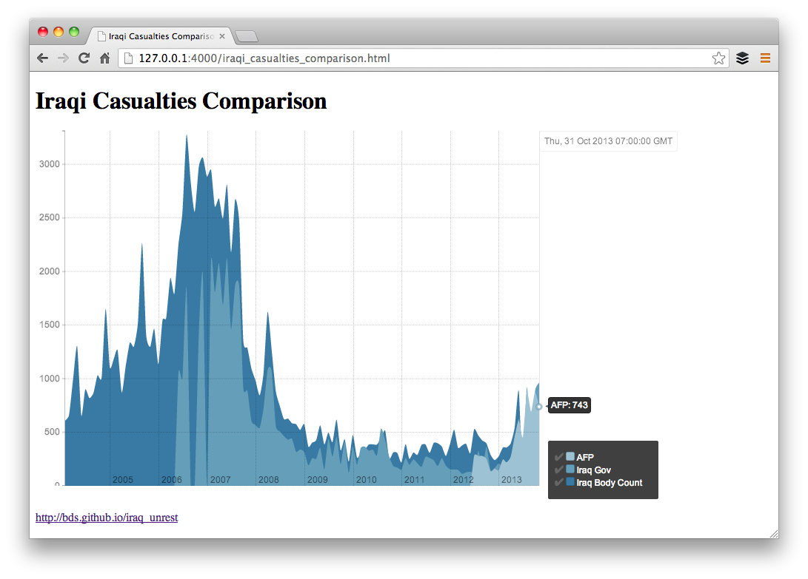
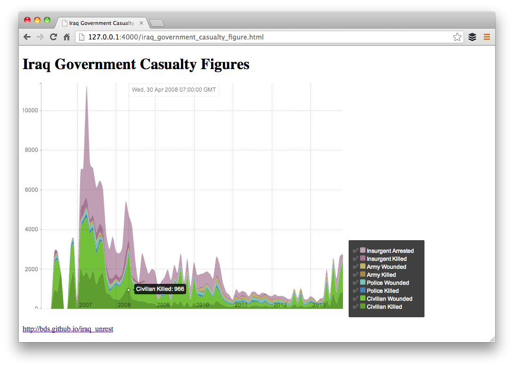

# IraqUnrest

Ruby library to assist in the visualization of Iraq data shared by Agence France-Presse.

* Supports serialzing into JSON, and Rickshaw.js data structures.
* Renders formatted CSV or HTML to file or string.

## Installation

    $ gem install iraq_unrest

## Usage

### Data

Requests are made to a [Google Spreadsheet](http://u.afp.com/JSL) provided by Agence France-Presse.
If you have any questions about the data, please contact [AFP's Baghdad Bureau](https://twitter.com/prashantrao)

Data sets currently supported:

* <code>IraqiCasualtiesComparison</code>
* <code>IraqGovernmentCasualtyFigures</code>

Each data set has Ruby methods for serializing and formatting records.

### Visualization

A <code>visualize!</code> method is provided to create a time-series chart using HTML/Rickshaw.js

    irb(main):002:0> IraqUnrest::IraqiCasualtiesComparison.visualize!

    => #<File:iraqi_casualties_comparison.html (closed)>

    irb(main):001:0> IraqUnrest::IraqGovernmentCasualtyFigure.visualize!

    => #<File:iraq_government_casualty_figure.html (closed)>

### Serialization
 
#### JSON

Use [ActiveModel::Serializers](https://github.com/rails-api/active_model_serializers/) to return all records as a JSON Array

    irb(main):003:0> IraqUnrest::IraqGovernmentCasualtyFigure.as_json
    
    [
        [ 0] {
                        :date => 1383202800,
             :civilian_killed => "855",
               :police_killed => "65",
                 :army_killed => "44",
            :civilian_wounded => "1445",
              :police_wounded => "88",
                :army_wounded => "67",
               :insurg_killed => "33",
             :insurg_arrested => "167"
        },
        ...
    ]

#### Rickshaw

Return all records as a JSON hash, using each attribute as a segment. This data set
can then be rendered into a Rickshaw.js graph.

    irb(main):004:0> IraqUnrest::IraqiCasualtiesComparison.as_rickshaw

    {
                    :afp => [
            [  0] {
                :x => 1075536000,
                :y => 0
            },
            [117] {
                :x => 1383202800,
                :y => 743
            }
        ],
               :iraq_gov => [...],
        :iraq_body_count => [...]
    }

### Formatting

#### CSV

CSV methods provide clean and formatted data as a string or file. 

Creates a CSV file in local working directory

    irb(main):005:0> IraqUnrest::IraqGovernmentCasualtyFigure.to_csv!

    => #<File:iraq_government_casualty_figure.csv (closed)>

As a string

    irb(main):006:0> IraqUnrest::IraqGovernmentCasualtyFigure.to_csv

    => "date,civilian_killed,police_killed,army_killed,civilian_wounded,police_wounded..."

## Running tests

    $ git clone git@github.com:bds/iraq_unrest.git
    $ cd iraq_unrest
    $ bundle install
    $ bundle exec rake test
    Run options: --seed 42961

    # Running tests:

    ....................................................................

    Fabulous tests in 0.616394s, 110.3190 tests/s, 3844.9433 assertions/s.

    68 tests, 2370 assertions, 0 failures, 0 errors, 0 skips

## Contributing

1. Fork it
2. Create your feature branch (`git checkout -b my-new-feature`)
3. Commit your changes (`git commit -am 'Add some feature'`)
4. Push to the branch (`git push origin my-new-feature`)
5. Create new Pull Request
